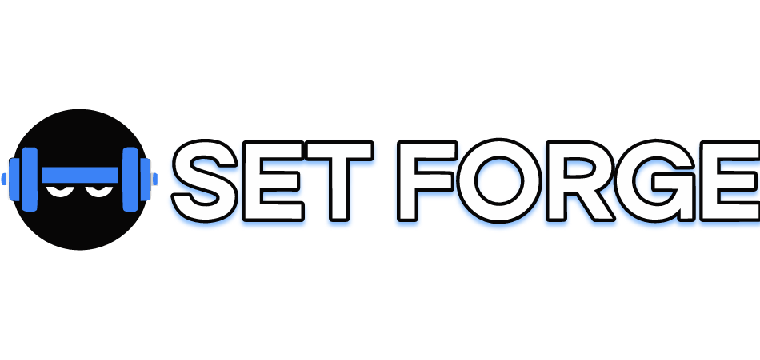

# @set-forge/client — Set Forge Web Client

Workout planning and strength tracking web app (React, Vite, TanStack Router, FSD). This package lives under `client/` in the monorepo.

**Monorepo setup, versioning, and releases:** see the [root README](../README.md).

---

<p align="center">
  
</p>


## Description

A workout planning and strength tracking web-app that lets you build exercise lists, log sets and weights, rate perceived effort, and visualize progress over time.

**State:** server data via TanStack Query; client-only UI state (e.g. theme) via Zustand where needed.

## Prerequisites

From the **repository root**: Node `v22.20.0`, npm `v10.9.3` (see root README). Run `npm install` once at the root to install all workspaces and git hooks.

## Available scripts

From the **repository root**, use the `client:*` aliases (see [root README](../README.md#client-set-forgeclient)). From **`client/`**, use the names below.

| Command | Description |
|--------|-------------|
| `npm run dev` | Vite dev server |
| `npm run build` | `tsc && vite build` |
| `npm run preview` | Preview production build (`client/dist`) |
| `npm run format` / `npm run format:check` | Prettier |
| `npm run lint` / `npm run lint:fix` | ESLint |
| `npm run test:unit` / `npm run test:unit-cov` | Jest unit tests |
| `npm run test:snap` / `npm run test:snap-cov` / `npm run test:snap-update` | Snapshot tests |
| `npm run test:e2e` | Playwright e2e (headless in CI; headed locally via config) |
| `npm run test:e2e:headed` | Playwright with a visible browser, one worker |
| `npm run test:e2e:ui` | Playwright UI mode (pick and watch tests) |
| `npm run test:e2e:debug` | Playwright debug (step through with inspector) |
| `npm test` | Unit + snap + e2e |
| `npm run storybook` / `npm run build-storybook` | Storybook |
| `npm run chromatic` | Chromatic |
| `npm run docs` | TypeDoc |
| `npm run generate:icons` | Regenerate favicon/OG PNG/ICO from `public/*.svg` (see below) |
| `npm run e2e:install` | Download Playwright browsers (required once after `npm install` or Playwright upgrade) |
| `npm run check-deps` / `npm run upgrade-deps` | Dependency maintenance |

### `generate:icons`

[`scripts/generate-public-icons.mjs`](scripts/generate-public-icons.mjs) — rasterizes SVG sources in [`public/`](public/) with `@resvg/resvg-js`, builds `favicon.ico` with `to-ico`.

**Source of truth (edit manually, then re-run the script):**

| File | Used for |
|------|----------|
| [`logo.svg`](public/logo.svg) | Header wordmark (`/logo.svg` on the home page); also drives OG assets |
| [`favicon.svg`](public/favicon.svg) | Dumbbell icon — all favicon / PWA PNG sizes |

[`manifest.json`](public/manifest.json) is **not** generated — update it by hand (app name, theme colors, icon paths).

**Generated output (commit together with the SVG sources):**

| File | From |
|------|------|
| `favicon-16x16.png`, `favicon-32x32.png`, `favicon-48x48.png`, `favicon-180x180.png`, `favicon-192x192.png`, `favicon-512x512.png` | `favicon.svg` |
| `favicon.ico` | PNG 16 / 32 / 48 |
| `logo-og.svg`, `logo-og.png` | `logo.svg` (950×451, vertical padding for `og:image` in [`index.html`](index.html)) |

```bash
npm run generate:icons          # from client/
npm run client:generate:icons   # from repo root
```

### E2E (Playwright)

Browser binaries are **not** installed by `npm install`. Before the first e2e run (or after `@playwright/test` is upgraded):

```bash
npm run e2e:install          # from client/
# or from repo root:
npm run client:e2e:install
```

`test:e2e` starts (or reuses) the Vite dev server on port **5173**; the Nest API is **not** required for current smoke tests. To watch tests in a real browser window, use `test:e2e:headed` or `test:e2e:ui`.

## API base and dev proxy

The client always calls the API through the same-origin `/api/1.0` base path. In the production compose stack, `client-prod` nginx reverse-proxies `/api/` to `server-prod`, while Caddy provides HTTPS in front of nginx.

For local development, Vite proxies `/api` to a backend target:

- Default: `http://localhost:5001`
- Override: copy [`.env.example`](.env.example) to `.env` / `.env.local` and set `VITE_DEV_API_PROXY`, for example `https://staging.example.com`

`VITE_PUBLIC_ORIGIN` (see [`.env.example`](.env.example)) is substituted into `index.html` OG/Twitter meta tags at dev/build time. Use the same public origin as `CLIENT_URL` in production (no trailing slash). For the Docker stack, set it in the root `.env` — compose passes it as a build arg; env files are not copied into the image. See [DEPLOY-SELECTEL.md](../DEPLOY-SELECTEL.md#83-vite_public_origin-og-meta-tags).

The app intentionally keeps one same-origin API base for both prod and dev.

## Environment used for verification

- Node: `v22.20.0`
- npm: `10.9.3`
