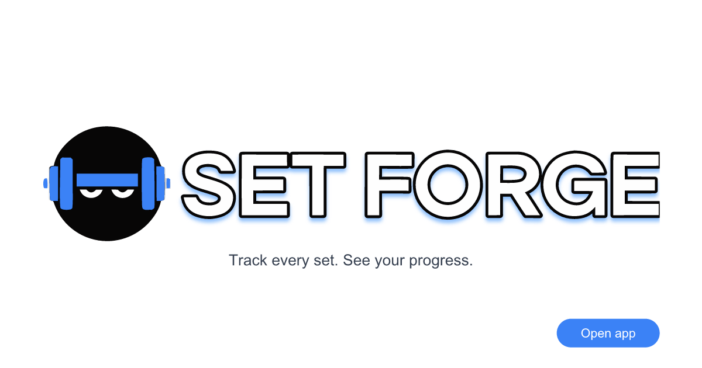

# @set-forge/server — Set Forge API

NestJS HTTP API for Set Forge web-client: authentication, workout lists flow (Sequelize + MySQL). This package lives under `server/` in the monorepo.

**Monorepo setup, versioning, and releases:** see the [root README](../README.md).

---

<p align="center">
  
</p>


## Description

Build workout lists, log sets and weights, rate perceived effort, and track strength progress over time.

## Prerequisites

From the **repository root**: Node `v22.23.2`, npm `v10.9.8` (see root README). Run `npm install` once at the root to install all workspaces and git hooks.

Local development typically needs MySQL (see root **Docker** scripts: `db:up` / `db:down`) and env files such as `.development.env` expected by `ConfigModule`.

For the production compose stack, copy `.production.env.example` to `.production.env` before `npm run prod:up`. `SERVER_URL` and `CLIENT_URL` must match the public HTTPS origin served by Caddy (for example `https://localhost` locally or `https://185-10-20-30.sslip.io` on a VDS). The server container keeps a read-only root filesystem; compose mounts persistent writable volumes for `SERVER_STATIC=static` and `SERVER_LOGS=logs`.

## Available scripts

From the **repository root**, use the `server:*` aliases (see [root README](../README.md#server-set-forgeserver)). From **`server/`**, use the names below.

| Command | Description |
|--------|-------------|
| `npm run start` | `nest start` (production mode env) |
| `npm run start:dev` | `nest start --watch` (development) |
| `npm run start:debug` | `nest start --debug --watch` |
| `npm run start:prod` | Run compiled `dist/src/main` |
| `npm run build` | `nest build` (`tsc` compile) |
| `npm run format` / `npm run format:check` | Prettier |
| `npm run lint` | Linter config types, then ESLint |
| `npm run lint:config` | Types of `eslint.config.ts` and `linter/` (`tsconfig.linter.json`) |
| `npm run lint:eslint` / `npm run lint:eslint:fix` | ESLint (`:fix` applies its autofixes) |
| `npm run test:unit` / `npm run test:unit-watch` / `npm run test:unit-cov` / `npm run test:unit-debug` | Jest unit tests |
| `npm run test:e2e` | Jest e2e (`jest-e2e.json`) — in-process Nest app + ephemeral MySQL via Testcontainers |
| `npm run db:migrate` / `npm run db:migrate:undo` / `npm run db:migrate:undo:all` / `npm run db:migrate:status` | Sequelize migrations against the **local** DB (uses `server/.development.env`) |
| `npm run db:seed` / `npm run db:seed:undo` | Sequelize seeders against the **local** DB |
| `npm run check-deps` / `npm run upgrade-deps` | Dependency maintenance |

The same against the running **prod** container (`docker compose exec server-prod ...`) is root-only: `npm run prod:db:migrate` / `:undo` / `:status`, `npm run prod:db:seed` / `:undo` (see root README).

## E2E tests

Server e2e tests boot the Nest app **in-process** and start an ephemeral MySQL 8.4 container via [Testcontainers](https://node.testcontainers.org/). No manual `db:up` or `server:start:dev` is required.

**Prerequisites:** Docker must be running locally (and is available on GitHub Actions `ubuntu-latest`).

```bash
npm run server:test:e2e
```

On startup, Jest `globalSetup` migrates and seeds the container database using `server/.e2e.env` (see `.e2e.env.example`). Runtime `MYSQL_*` values are written to `test/e2e/.runtime-env.json` (gitignored) and injected before each spec file runs.

Browser full-stack e2e (`npm run client:test:e2e`) uses the same `.e2e.env` secrets and a separate ephemeral MySQL container, but starts a **listening** Nest process on port **5101** with `CLIENT_URL=http://localhost:5174`.

## Database schema (Sequelize migrations)

The schema is owned by [`sequelize-cli`](https://github.com/sequelize/cli) migrations under `server/database/`. `synchronize` is hard-coded to `false` in `app.module.ts`, so neither dev nor prod will ever auto-create or auto-mutate tables — every change must land as a migration.

Layout:

```
server/
  .sequelizerc                  # tells the CLI where config / migrations / seeders live
  database/
    config.js                   # reads MYSQL_* from .${NODE_ENV}.env (or already-injected env)
    migrations/                 # timestamped, run in order, one row per file in `SequelizeMeta`
    seeders/                    # idempotent default data (e.g. roles)
```

### Local workflow (against `mysql-dev` from `npm run db:up`)

```bash
npm run db:up                   # start MySQL container if it is not already up
npm run server:db:migrate       # create all tables on a fresh DB
npm run server:db:seed          # insert default `user` / `admin` roles
npm run server:db:migrate:status
```

The CLI picks the env file via `database/config.js`: `--env <name>` flag wins, otherwise `NODE_ENV`, otherwise `development`. The corresponding `.<env>.env` next to `server/database/` is loaded (variables already in `process.env` win).

### Production workflow (inside the prod container)

After `npm run prod:up` finishes and the server is healthy, apply migrations / seeds against the prod database **without restarting** the API:

```bash
npm run prod:db:migrate
npm run prod:db:seed            # only on first deploy, or when adding new seed data
npm run prod:db:migrate:status
```

These wrap `docker compose --profile prod exec server-prod npx sequelize-cli ...`. The container has `database/` and `.sequelizerc` baked in by `server/Dockerfile`, and `MYSQL_*` are injected by the compose `env_file` so no extra mounts are needed.

### Adding a new migration

```bash
# from the repo root
cd server
npx sequelize-cli migration:generate --name add-something
# edit the generated file in server/database/migrations/
npm run db:migrate -w @set-forge/server
```

Keep migrations forward-only and reversible (`up`/`down`). Never edit a migration that has already been applied to a shared DB — write a new one instead.

## Environment used for verification

- Node: `v22.23.2`
- npm: `10.9.8`
